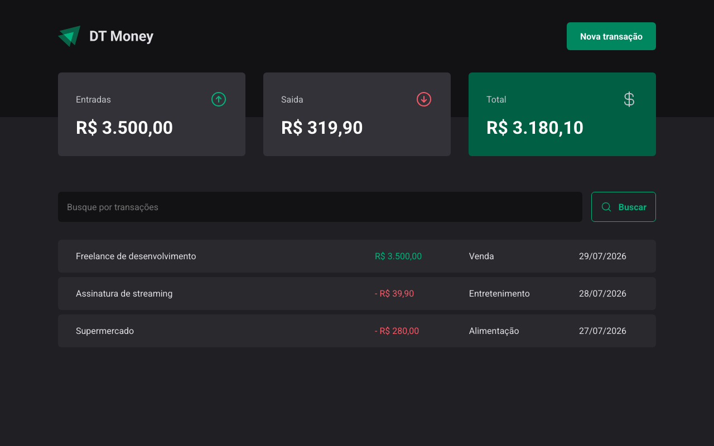

# DT Money

A financial management web app built with React. Built in January 2023 during Rocketseat's front-end course to practice Vite, Styled Components, Radix UI and form handling with Zod.

🔗 [Live demo](https://dt-money-nine-indol.vercel.app)

## Features:

- Registers income and expenses;
- Views transaction history.

### Technologies Used:

- Vite to speed up development and provide better performance when building the project;
- Styled Components to write CSS within the JavaScript itself, making the code more modular and easier to maintain;
- Radix UI to provide accessible and responsive components, as well as offering flexibility and customization;
- Axios to handle HTTP requests in an easy and efficient way;
- Zod for safe and simple schema data validation;
- React Hook Form to manage forms in a simple and performant way.

### How to use:

1. Clone this repository to your computer;
2. Install project dependencies with the command npm install;
3. Start the development server with the command npm run dev;
4. Access the address http://localhost:3000 in your browser to view the project.
